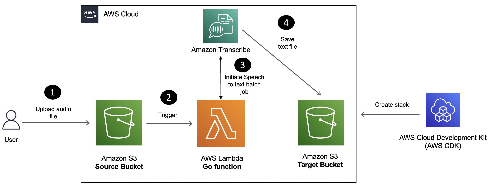

# Use Go with AWS Lambda and Amazon Transcribe to build a speech to text converter

In this blog post, you will learn how to build a Serverless speech to text conversion solution using [Amazon Transcribe](https://docs.aws.amazon.com/transcribe/latest/dg/what-is.html), [AWS Lambda](https://aws.amazon.com/lambda/) and the [Go](https://go.dev/) programming language. Audio files uploaded to Amazon Simple Storage Service (S3) will trigger a Lambda function which will submit an asynchronous job to Amazon Transcribe ([using the AWS Go SDK](https://pkg.go.dev/github.com/aws/aws-sdk-go-v2/service/transcribe)) which will in turn store the result in another S3 bucket.

